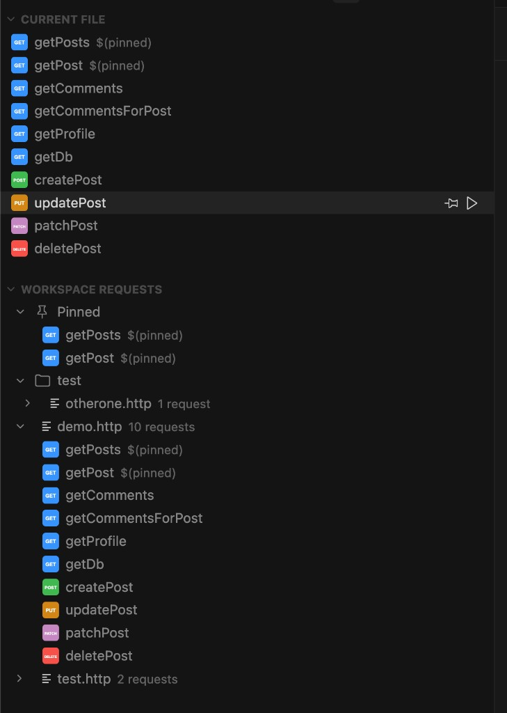
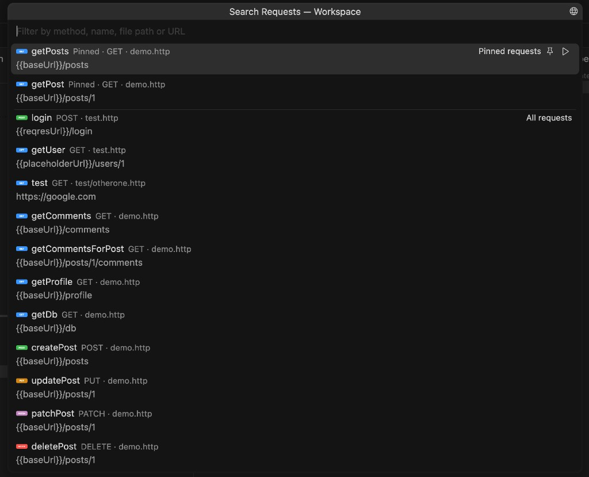

# httpYac PrimeNav

Workspace-wide navigation for `.http` and `.rest` files using [httpYac](https://httpyac.github.io/) conventions.

It adds a dual-panel tree, fuzzy search and metadata-aware grouping for httpYac request files.



## Features

- **Dual tree views** — the sidebar shows two panels side by side:
  - **Current File** (top) — visible only when an `.http` / `.rest` file is active; lists its sections and requests fully expanded.
  - **Workspace Requests** (bottom) — full workspace tree, collapsed by default, with automatic reveal of the active file.
- **Method badge icons** — `GET`, `POST`, `PUT`, `PATCH`, `DELETE` and other HTTP verbs are rendered as coloured SVG badges, making the method immediately visible.
- **Fuzzy search** over every request, filterable by method, name, file path or URL — `Cmd/Ctrl+Shift+H` opens it scoped to the current file, `Cmd+Ctrl+H` / `Ctrl+Alt+H` opens it workspace-wide, and a title-bar button toggles the scope once open.
- **Pinned requests** — pin any request from the tree or the search picker; pinned requests appear at the top of the tree and at the top of the quick-pick when the search box is empty. Pins are persisted per-workspace.
- **httpYac metadata aware** — `# @name`, `# @title`, `# @ref`, `# @forceRef`, `# @disabled`, `# @import` and `####` sections shape the labels and grouping.
- **Click to reveal** — jump straight to the request line in the editor.
- **Send delegation** — when the [httpYac extension](https://marketplace.visualstudio.com/items?itemName=anweber.vscode-httpyac) is installed, an inline ▶ button runs the request through it.

This is a **navigation-only** extension: it ships no HTTP engine and renders no responses. Execution is delegated to httpYac.

## Usage

1. Open a workspace containing `.http` / `.rest` files.
2. Click the **httpYac PrimeNav** icon in the Activity Bar.
3. Open an `.http` file — the **Current File** panel shows its requests immediately.
4. Browse the workspace tree or fuzzy-search requests: `Cmd/Ctrl+Shift+H` (current file) or `Cmd+Ctrl+H` / `Ctrl+Alt+H` (whole workspace).
5. Click a request to reveal it; use the ▶ action to send it via httpYac.



## Pinned Requests

Click the pin icon ($(pin)) next to any request in the tree, or the pin button on each item in the search picker, to pin it. Pinned requests:

- Appear in a **Pinned** group at the top of the activity bar tree.
- Are shown at the top of the quick-pick when the search box is empty.
- Survive editor restarts — pins are stored in workspace state.
- Are identified by `# @name` when present (stable across line shifts), otherwise by line number (best-effort).

If a pinned request is deleted or renamed, its tree entry turns into a stale *(missing)* node with a remove button.

## Settings


| Setting                           | Default              | Description                                   |
| --------------------------------- | -------------------- | --------------------------------------------- |
| `httpyacPrimeNav.fileGlob`        | `**/*.{http,rest}`   | Glob used to discover request files.          |
| `httpyacPrimeNav.excludeGlob`     | `**/node_modules/`** | Glob excluded from discovery.                 |
| `httpyacPrimeNav.groupBySections` | `true`               | Group requests under `#### Section` headers.  |
| `httpyacPrimeNav.showPinned`      | `true`               | Show the Pinned group at the top of the tree. |


## Development

```bash
npm install
npm run watch        # webpack in watch mode
npm test             # jest unit tests (parser + workspace index)
npm run lint
npm run test:integration   # @vscode/test-electron smoke test
```

Press `F5` in VS Code / Cursor to launch the Extension Development Host.

## License

MIT